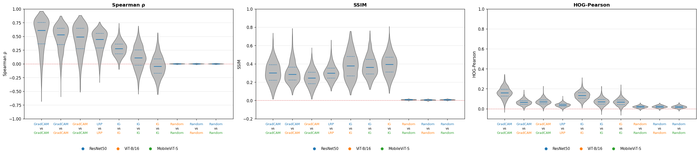
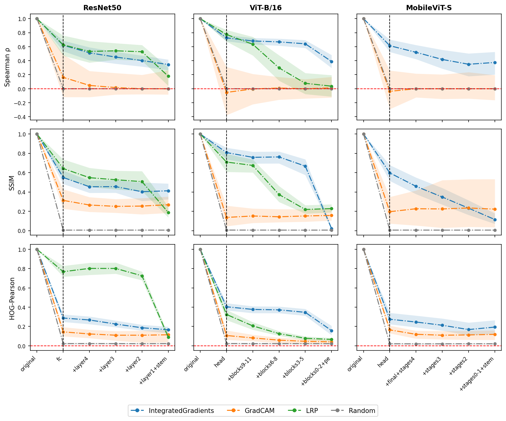
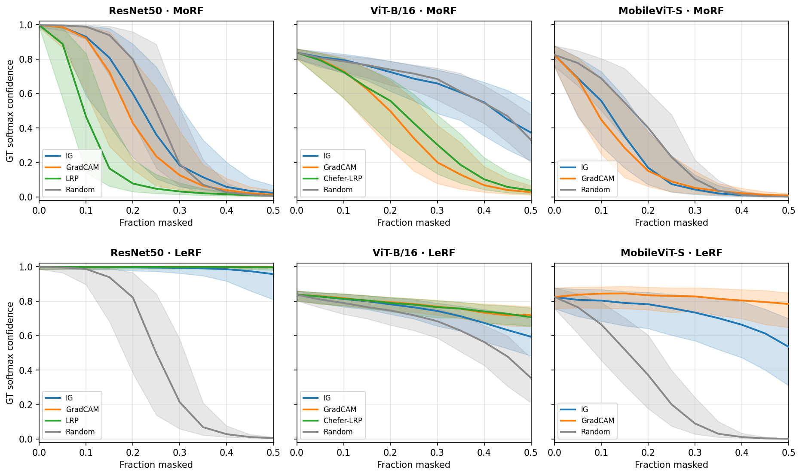
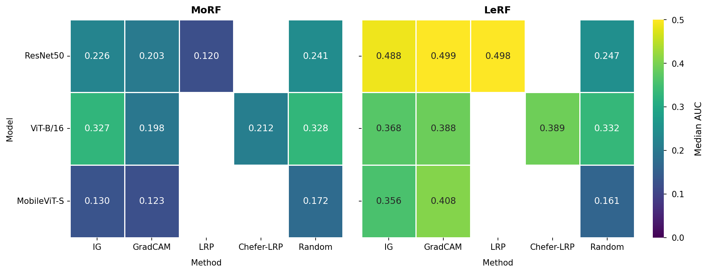
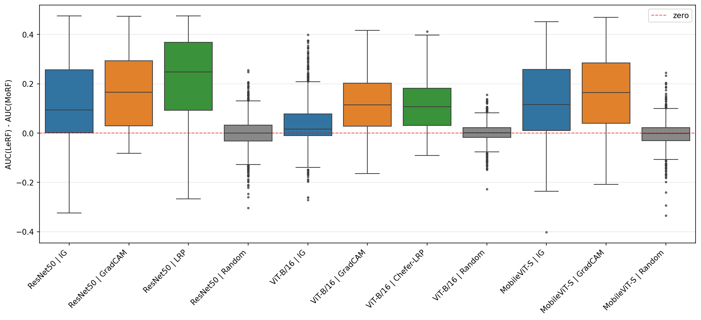
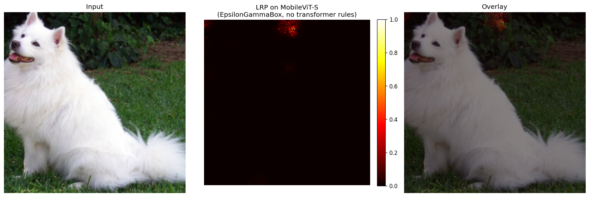
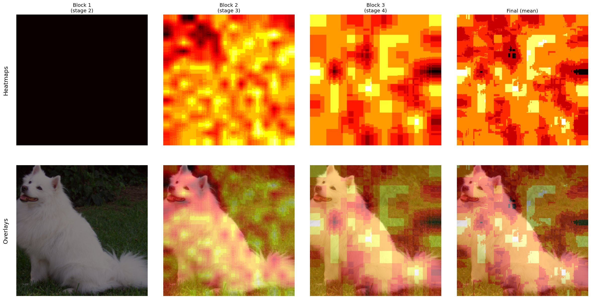

# Explainability Sanity Audit

*Auditing how the trustworthiness of post-hoc explanation methods depends on the architecture family: across CNN, ViT, and hybrid models.*

A systematic audit of post-hoc explanation methods (Integrated Gradients, GradCAM, LRP) across three architecture families, using parameter-randomization sanity checks (Adebayo et al., 2018) and deletion-based faithfulness tests. The individual failure modes are known from the sanity-check and faithfulness literature. The contribution is a clean, even-handed audit of them side by side across three architecture families, together with a deliberately exploratory attempt at hybrid LRP that identifies concrete obstacles for follow-up work.


## Key findings

- **Integrated Gradients fails the parameter-randomization sanity check the same way on all three architectures.** Its similarity to the trained-model heatmap never approaches the random floor, leaving an architecture-stable residual (final-stage Spearman 0.345 / 0.389 / 0.375 on ResNet50 / ViT-B/16 / MobileViT-S) consistent with an input-driven rather than parameter-driven signal.

- **On ViT-B/16, Integrated Gradients is also causally uninformative:** under deletion, its MoRF-AUC (0.327) is numerically indistinguishable from the random baseline (0.328), and one image in three ranks anti-faithfully.

- **GradCAM is the only method that is both parameter-sensitive and deletion-faithful on every architecture** (median faithfulness gaps 0.165 / 0.114 / 0.165), though its coarse maps leave spatial selectivity uncertified.

- **"LRP" is two methods, not one.** The CNN composite (EpsilonGammaBox) largely fails the sanity check on ResNet50 while being the most faithful method there. The transformer variant (Chefer et al., 2021) passes the sanity check cleanly on ViT-B/16. Method trust does not transfer across an "LRP family".

- **No working LRP exists for the hybrid.** The CNN composite runs without error and returns a numerically well-behaved map, but its relevance lands in the wrong region entirely. A transformer-side construction produces maps with no usable structure. Both miss the conv-transformer boundary, which is the actual open problem.

- **The metric decides the conclusion:** the cross-architecture ranking of methods inverts between Spearman and SSIM, so agreement claims are only meaningful relative to a named metric.


## Motivation

Post-hoc attribution methods are the default way to inspect a trained classifier: they require no change to the model and turn its decision into a heatmap over the input. Inherently interpretable models are an increasingly argued-for alternative (Rudin, 2019), but for the large body of already-trained black-box systems they are not an option. So the practical question is rarely *whether* to use post-hoc explanations, but *how far* to trust them. These methods were largely developed in the context of convolutional networks, and extending them to attention-based and hybrid architectures is not always straightforward.

Trust here cannot be read off the picture. A heatmap can look plausible and still be wrong. It can place relevance off the object, or rank input regions in a way that has no causal bearing on the prediction, and visual plausibility is no guarantee of either correctness or faithfulness. Whether a method remains trustworthy is also not guaranteed to be architecture-invariant: a method validated on CNNs may behave differently on a vision transformer. Because "trustworthy" is itself multi-dimensional, this audit probes two independent axes: whether a method's attributions are sensitive to the model's parameters (sanity checks) and whether the regions it highlights are causally important (faithfulness).

Individual instances of this architecture–method interaction are documented across the literature, typically one diagnostic, one method, or one architecture family at a time. This audit puts them side by side: the same methods, the same images, and the same three diagnostics (agreement, sanity checks, faithfulness) on a CNN, a ViT, and a hybrid. The question:

> **Are common post-hoc explanation methods equally trustworthy across CNN, ViT, and hybrid CNN-ViT architectures, and if not, how does the failure mode depend on the architecture family?**


## At a glance

To investigate this, the audit pairs four attribution methods with three architecture families and probes them along the two axes above. The methods are Integrated Gradients, GradCAM, and an LRP variant per architecture (LRP according to Chefer et al. (2021) for the transformer), plus a random baseline that fixes the noise floor. The models are ResNet50 (CNN; He et al., 2016), ViT-B/16 (vision transformer; Dosovitskiy et al., 2021), and MobileViT-S (hybrid; Mehta & Rastegari, 2022), all pretrained on ImageNet-1k. All experiments run on a fixed 1,000-image subset of the ImageNet-1k validation set (500 classes × 2 images).


Three experiments make up the audit, each probing a different facet of how far the methods can be trusted: a dataset-level agreement analysis that maps where the methods coincide, a parameter-randomization sanity check, and a deletion-based faithfulness test (Samek et al., 2017). Across all three, the methods turn out to differ sharply in how, and how much, their trustworthiness depends on the architecture, rather than degrading uniformly.

**Repository layout**
```
explainability-sanity-audit/
├── README.md
├── LICENSE
├── requirements.txt
├── data/               
│   └── manifests       Subset manifests driving all dataset-axis scripts
├── src/                Library code (models, metrics, attribution methods)
│   └── methods/        Attribution methods, including the LRP implementation according to Chefer et al.
├── scripts/            Numbered, runnable experiments, executed in order
└── results/
    ├── tables/         Aggregated result tables (Parquet)
    └── figures/        Generated figures
```

The code is research code for reproducing these experiments, not a packaged library. Setup and reproduction are described under [Setup](#setup).


## Methods

### Data

All experiments run on a fixed subset of the ImageNet-1k validation set: 500 of the 1,000 classes, drawn at random, with 2 images per class, 1,000 images in total. Sampling is fully deterministic. The class subset is drawn with a single fixed seed, and the two images within each class are then drawn with a separate per-class seed, so that each class's selection is reproducible and independent of how the rest of the subset is composed (adding or removing classes does not disturb the images chosen for the others). Class folders and image files are sorted before sampling, so nothing depends on filesystem order. The resulting selection is written to a manifest that drives every downstream script.

Before any experiment runs, the manifest is checked against timm-pretrained ResNet50: each sample's labelled class index is compared with the model's top-5 predictions. The point is not to measure accuracy but to catch a silent indexing failure. An off-by-one or a sorting mistake in the class indexing would corrupt every downstream comparison while leaving the heatmaps superficially intact. At 79.4% top-1 and 94.4% top-5 the rates sit in the normal range for ResNet50 on this set, and the small fraction of samples whose label falls outside the top-5 are genuine misclassifications between visually similar classes (neighbouring dog breeds, lookalike snakes) rather than the constant index shift a sorting or off-by-one bug would produce. The check thus confirms the indexing is sound rather than flagging a manifest bug.


### Methods and models

Three pretrained timm models stand in for three architecture families: ResNet50 (a pure CNN), ViT-B/16 (a pure vision transformer), and MobileViT-S (a convolution–transformer hybrid), all pretrained on ImageNet-1k. Four attribution methods are applied to them. The table records which method runs on which architecture. The empty cell is not an oversight but part of the finding, and is explained underneath.

| Method | What it measures | Implementation | ResNet50 | ViT-B/16 | MobileViT-S |
|---|---|---|:---:|:---:|:---:|
| Integrated Gradients | input-gradient attribution along a baseline path | Captum | ✓ | ✓ | ✓ |
| GradCAM | gradient-weighted activations of a target layer | `pytorch-grad-cam` | ✓ | ✓ | ✓ |
| LRP | layer-wise relevance propagation | zennit (CNN) / own (transformer) | ✓ | ✓ | — |
| Random | uniform noise; the lower-bound control | own | ✓ | ✓ | ✓ |

The "LRP" row hides the central subtlety of the whole audit: it is not one method but two different implementations of the same family. On ResNet50 it is zennit's EpsilonGammaBox composite, an established best-practice rule set for image-classification CNNs (Bach et al., 2015). On ViT-B/16 it is a from-scratch implementation of LRP following Chefer et al. (2021), which uses transformer-specific propagation rules. These are genuinely different code paths chosen per architecture, a fact that becomes important once the findings compare "LRP" across architectures.

The MobileViT-S cell is empty by decision, not by failure. The CNN-style composite *does* run on MobileViT. It returns a numerically valid map without error. But propagating CNN-style LRP rules across the convolution–transformer boundary is unsound, and it does so silently: no error, a numerically well-behaved map, but relevance in the wrong place. This is a silent failure mode rather than a crash, and it is examined as such in the findings. Rather than admit a misleading result into the comparison, MobileViT is excluded from the CNN-style LRP. The transformer-aware alternative is described below.

Each method is a thin wrapper over a uniform `explain(x, target)` interface that returns a single 2D heatmap normalised to [0, 1] (see [Normalization](#normalization)). Integrated Gradients (Sundararajan et al., 2017) integrates input gradients along a straight-line path from a black (zero) baseline, with 50 integration steps. The per-pixel attribution is the absolute sum across colour channels. GradCAM (Selvaraju et al., 2017) weights a target layer's activations by class-conditional gradients and upsamples to input resolution. The target layer is the last bottleneck block on ResNet50, the final convolutional stage on MobileViT-S. On ViT-B/16, it is the first normalisation layer of the last transformer block, where a reshape step folds the 196 patch tokens back into a 14×14 grid (dropping the CLS token) so the token sequence can be treated like a CNN feature map. Random draws uniform noise at the input resolution and ignores the model and target entirely. In the multi-image runs it is re-seeded per (sample, model, target) so that it remains a valid control on every comparison axis.

Throughout the experiments that follow, each method is applied only to the architectures it supports, so MobileViT-S appears with Integrated Gradients, GradCAM and Random only.

#### The ViT LRP implementation and its validation

Of the four methods, the ViT LRP is the only one called from no library: no existing implementation fit the uniform cross-architecture interface used here. Following Chefer et al. (2021), it propagates relevance through the transformer using gradient-weighted attention, combined across the twelve blocks with a per-block conservation (row-normalisation) step.

Because a from-scratch implementation needs validation, and because matching a reference implementation would only show *consistency with that reference*, a shared bug would agree silently, it was instead checked against properties that follow from the algorithm itself. Three hold cleanly: per-block conservation (worst-case row-sum deviation from 1.0 of ~3.6 × 10⁻⁷, i.e. floating-point noise), determinism (two runs bitwise identical), and target sensitivity (the map for the predicted class versus an unrelated class (flamingo, class 130) correlates at Spearman ρ = 0.82: positive, since foreground and edge saliency are shared across classes, but well below 1, confirming the target gradient genuinely modulates the map). A fourth property, sensitivity to the model's parameters, is structurally the first stage of the parameter-randomization sanity check below and is taken up there.

#### An exploratory hybrid LRP for MobileViT

The transformer-aware alternative is a deliberately exploratory one: can the construction used on ViT be carried over to the hybrid's transformer stages? timm's MobileViT-S contains three MobileViT blocks (in stages 2–4), each wrapping two transformer blocks that operate not on a global token sequence but on small local windows: the feature map is unfolded into 2×2 sub-patches, four slots, and attention runs within each slot.

The attempt mirrors the ViT construction at the slot level. Within each MobileViT block, gradient-weighted attention relevance is accumulated through that block's two transformer blocks, separately for each slot. The resulting per-slot, per-token relevance is then re-folded into a single 2D map for the block, each value returned to the spatial position the unfold took it from. The three block-level maps are upsampled to input resolution and averaged into the final heatmap.

The construction is intentionally partial:

* Relevance flows only through the transformer stages, not the convolutional stem, bottleneck blocks, or final convolution.
* Conservation is not maintained across the unfold–refold boundary between convolutional feature maps and the local token windows.
* The three block maps are combined by resize-and-average rather than a principled cross-stage relevance flow.

What this version produces, and where it breaks down block by block, is shown in the hybrid-LRP analysis of the findings. What a faithful hybrid LRP would require is taken up under Limitations.


### Normalization

Every method returns a single non-negative 2D map, which is min–max normalised to [0, 1] per image before any metric sees it, with a guard that sends a constant map (range below 1e-8) to all zeros rather than dividing by zero. Normalising per map, rather than on a shared scale, is deliberate. The raw output ranges differ by orders of magnitude between methods and carry no explanatory meaning, and every metric used here, both the agreement metrics and the faithfulness measures, reads relative structure (rank order, local spatial pattern) rather than absolute magnitude. Removing the raw scale therefore costs nothing the metrics would have used, and it lets all four methods be compared on equal terms, which an even-handed audit requires.

The reduction to a non-negative magnitude does discard one thing: the sign of the attribution, dropped where each map is collapsed to a magnitude (by absolute value for Integrated Gradients and the CNN LRP, by the positive-relevance clipping built into GradCAM and the transformer LRP construction). This affects LRP most, since it is natively signed. A signed-relevance analysis is deliberately out of scope (none of the audit's questions turn on it) and what the choice costs is taken up under [Limitations](#limitations-and-outlook).


### The agreement analysis: pairwise metrics

The first of the audit's three experiments compares two heatmaps at a time, using three distinct metrics, and analyzes whether or not they *agree* with each other. *Agreement* here means the degree to which two different attribution maps (two methods on the same model, or one method on two architectures) highlight the same regions of an image. It is the descriptive groundwork the other two experiments build on: where methods disagree, the cause is either an artefact of one method or a genuine difference in what the architectures attend to, and telling those apart is part of the audit's question. Agreement is deliberately a descriptive notion, not a verdict: two maps agreeing does not make either correct, a point the faithfulness experiment will return to. It is also not single-valued: two maps can rank pixels almost identically yet differ in local structure, and only a panel of complementary metrics makes that visible.

The metrics used are the following. Spearman rank correlation, computed over all pixels of the two flattened maps, asks whether the two methods order the image's pixels by importance in the same way. SSIM (skimage's structural similarity, with the data range fixed to 1) asks whether they agree on local spatial structure, comparing luminance, contrast and structure within small sliding windows. A HOG-based correlation asks whether they agree on the orientation of edges and texture across the map. It is a Pearson correlation between histogram-of-oriented-gradient descriptors (9 orientations, 8×8-pixel cells, 2×2-cell block normalisation). All three metrics are taken from the saliency sanity-check methodology of Adebayo et al. (2018), which uses exactly this trio to compare attribution maps. The same three metrics reappear in the sanity check below, there comparing each randomized map against its trained counterpart.

Spearman is used in its *diverging* form, without taking the absolute value, so that negative correlations are kept rather than folded onto positive ones. This is the variant directly comparable to the signed Spearman column in Adebayo et al. (2018), and negative values carry meaning (two maps anti-ranked, not merely unrelated). One convention follows from a degenerate case: a constant map makes the rank correlation undefined, and the code maps that to 0.0, so a Spearman of exactly zero can mean either a genuine null correlation or a collapsed constant map. For the random baseline it is almost certainly the former. The HOG correlation uses the same zero fallback when a descriptor has near-zero variance. SSIM has no such fallback. (Min–max normalisation, incidentally, leaves the rank-based Spearman untouched but does affect SSIM, which compares the maps as [0, 1] images, one more reason it is applied uniformly before any metric.)

These metrics are computed pairwise along three axes, which together form the dataset-level agreement analysis. The *cross-model* axis fixes a method and varies the architecture (e.g. GradCAM on ResNet50 vs. on ViT-B/16), asking how stable a method's attributions are across architecture families. The *cross-method* axis fixes an architecture and varies the method (e.g. Integrated Gradients vs. GradCAM on ResNet50), asking how much the methods agree with each other on a given model. The *cross-target* axis fixes both model and method and varies the explained class, comparing the map for the ground-truth class against the map for the model's predicted class. Cross-model and cross-method use ground-truth-target maps throughout. For cross-model, MobileViT-S's 256×256 maps are area-downsampled to the 224×224 of the other two models (downsampling aggregates neighbouring pixels, whereas upsampling would invent values and inflate structural similarity). On the cross-model axis the two per-architecture LRP implementations (EpsilonGammaBox on ResNet50, the construction on ViT-B/16 according to Chefer et al.) are paired under a single "LRP" family label, which is exactly why the "two different implementations" caveat above matters when reading cross-model LRP results. The cross-target axis carries a built-in subtlety: on correctly classified images the ground-truth and predicted classes coincide, so the two maps are identical and agreement is trivially perfect. The axis is therefore informative only on misclassified images, and the findings read it on the subset misclassified by all three models.


### The sanity check: cascading parameter randomization

The second experiment turns from how the methods relate to each other to a property that agreement alone cannot establish: whether a method's attributions actually depend on what the model has learned. A method that produces the same heatmap whether the model is trained or random is not explaining the model: it is responding to the input alone, and cannot be trusted to reflect a decision, no matter how well it agrees with other methods. The test is the cascading parameter-randomization variant of the model-parameter randomization test (Adebayo et al., 2018): starting from the trained model, the parameters are progressively replaced with random values from the output end inwards, and at each step the resulting heatmap is compared with the trained-model heatmap. A model-sensitive method's similarity to the trained baseline should fall as more of the model is destroyed. A method whose similarity stays high is insensitive to the model and fails the check.

Randomization follows the canonical scheme of layer-wise re-initialization. Each affected submodule is reset to fresh values from its own initialization distribution (PyTorch's reset_parameters), with BatchNorm running statistics reset to their defaults. The randomization is cascading and cumulative: five stages per architecture, each randomizing everything the previous stages did plus one more group, working from the head towards the input. The groups are architecture-specific: 

* ResNet50 in five cumulative steps (fc, then layer4, layer3, layer2, and layer1+stem).
* ViT-B/16 likewise (head, then blocks 9–11 with the final norm, blocks 6–8, blocks 3–5, and blocks 0–2 with the patch embedding).
* MobileViT-S the same way (head, then the final conv with stage 4, stage 3, stage 2, and stages 0–1 with the stem).

The exact module paths are listed in `src/randomization_schedule.py`. Stage 0 (only the head-most group randomized) is exactly the parameter-sensitivity property left open during the ViT LRP validation above, now measured in full.

Because the architectures differ in parameter count and structure, the absolute similarity values at a given stage are *not* comparable across families, but what is comparable is the *shape* of the similarity-versus-stage curve: how quickly, and from which depth, a method decouples from the trained model. The comparison uses the same three metrics as the agreement analysis (Spearman, SSIM, HOG), each cascading heatmap measured against its trained-model counterpart for the ground-truth class. Class sensitivity is not at issue here, so only ground-truth-target maps are generated.

The main run uses a single random seed per stage across all 1,000 images. This is defensible only if the choice of seed matters little next to the variation between images — otherwise one seed would be an unreliable stand-in for the random-initialization distribution. A separate validation tests this on a 10-image subset run with three seeds, comparing inter-seed against inter-sample variation, and tracking how far a cell's *median* similarity moves when the seed changes (the median rather than per-image drift, because the zero-collapse convention can make a single image's value jump between failure modes rather than reflect seed noise). With only ten images this is a rule-of-thumb threshold for which claims to make, not a significance test. The result, and the methods it qualifies, are reported with the findings.


### The faithfulness test: pixel flipping

The third experiment addresses what the first two leave open. Agreement shows where methods coincide, and the sanity check shows that they respond to the model. But neither shows whether the regions a method highlights are the ones that actually drive the prediction. A heatmap can be model-dependent and still point at the wrong pixels. Faithfulness is that missing property: do the regions a method ranks as important actually matter to the output?

The test is pixel flipping by deletion, a region-perturbation approach (Samek et al., 2017). Blocks of the input are masked in the order the heatmap ranks them, and the model's softmax confidence in the ground-truth class is tracked as more of the image is removed. Two orderings bracket the effect: under MoRF (most relevant first) the highest-ranked blocks are masked first, so a faithful heatmap should produce a steep early drop in confidence. Under LeRF (least relevant first) the lowest-ranked blocks go first, so a faithful heatmap should hold confidence high early on. Each curve is summarised by the area under it (confidence versus fraction masked, trapezoidal), following the deletion-AUC formulation of Petsiuk et al. (2018). For a faithful method the MoRF area is small and the LeRF area large. The gap between them (and, per image, the sign of that gap) is the faithfulness signal, and the random baseline fixes the level at which no ranking structure is present.

Several design choices fix the protocol. Importance is scored on 8×8-pixel blocks, a single fixed granularity applied identically, in pixel terms, to all three models. The heatmap is mean-pooled onto that grid rather than read per pixel. Masking replaces a block with the per-channel mean of the preprocessed image: a neutral grey matched to the image's colour cast, chosen over a black baseline (a strong, non-neutral value once the input is normalised) or noise (which would add structure of its own). Any masking baseline still takes the input somewhat off-distribution, so part of the measured confidence drop reflects distribution shift rather than removed information (Hooker et al., 2019). This is taken up under Limitations. Masking proceeds in 5% steps up to 50% of the blocks, and the area is integrated over exactly this [0, 0.5] range. The cap at half the image is because the discriminating behaviour is in the early part of the curve, while removing much more drives every method into the same heavily out-of-distribution regime. Only ground-truth-target maps enter this test, as in the sanity check (and unlike the agreement analysis, whose cross-target axis is the ground-truth-versus-predicted comparison). The heatmaps themselves are the trained-model maps generated once and reused across analyses, not recomputed here.

One subtlety mirrors, and inverts, a choice made for the agreement axes. Because the models have different native resolutions, the 8×8 block grid is 28×28 for ResNet50 and ViT-B/16 but 32×32 for MobileViT-S, so masking "5% of blocks" removes the same *fraction* of each image but a different absolute area. This is deliberate: faithfulness asks how fast a given model loses confidence as a fraction of its own input is removed, so the fraction is held constant rather than the pixel count. Where the cross-model agreement axis downsampled to a shared pixel grid to compare maps on equal terms, the faithfulness test holds the fraction equal instead — the right invariant for each question.


## Findings

The findings begin with a single image, because the whole audit rests on a claim that has to be established before it can be qualified: the pipeline works, and the methods produce sensible, recognisable attributions before any of them is taken apart. From there the results run in four analyses. First, agreement across the dataset, the sanity check, and the faithfulness test, each measured over all 1,000 images. Then, a closer look, on one image, at where the hybrid LRP breaks down.

The matrix below shows all four methods on all three architectures for one exemplary image, each map explaining the same ground-truth class. Random aside (it ignores the model by construction, so it is the same noise everywhere) none of the methods looks quite the same from one architecture to the next, which is itself the audit's question in miniature. Integrated Gradients keeps the same character throughout, sparse and concentrated on the dog, but its structure shifts: scattered points on ResNet50 and MobileViT-S, and on ViT-B/16 small point-clouds arranged on the patch grid, more diffuse and overlapping around the head. GradCAM varies far more in extent, though its peak intensity stays in roughly the same place throughout. For ResNet50 it is a tight blob on the head and upper chest, for ViT-B/16 the whole dog punctured by cold patches, for MobileViT-S almost the entire frame including background. LRP varies too, but for a different reason: fine and edge-like on ResNet50, concentrated on the head, and softer and more diffuse on ViT-B/16, where faint warmth extends over the whole body. This is because these are two different implementations of the same family rather than one method, a distinction the sanity check later analyses further. Across the methods, despite their very different spreads, the strongest response tends to fall on the same place (the head and upper chest) a single-image hint of the cross-model agreement the first analysis below tests at scale.


*Figure 1: Four methods (rows) on three architectures (columns), each map explaining the Samoyed's ground-truth class (ImageNet 258). The LRP row is a single family with a different implementation per architecture (zennit's EpsilonGammaBox on ResNet50, the variant following Chefer et al. on ViT-B/16). The grey MobileViT-S cell is deliberate (Methods explains why the hybrid carries no LRP).*

One detail is worth holding onto here, because a later discussion returns to it: the transformer LRP places two bright responses on the background, away from the dog. This is not an artefact but a phenomenon known as register tokens (Darcet et al., 2023), which the methodological lessons take up.


### Agreement across the dataset

Figure 1 showed a single case, from which the behaviour of the whole dataset cannot be read off. The agreement analysis, in Figure 2 (the cross-model view), asks whether those impressions hold across all images, under the three metrics side by side.



*Figure 2: Per-image agreement of each method applied to two different architectures (same method, different models), over all 1,000 images (Spearman, SSIM, HOG-Pearson; solid line = median, dashed = quartiles, red line at zero). Pairs are ordered by descending median Spearman, and that same order is reused in all three panels. So a method moving up or down between panels is the signal. LRP has a single bar because it runs on only two of the three architectures. The Random pairs at the right are the noise floor.*

#### Methods are architecture-sensitive, and not equally so

The Spearman panel sorts the methods into a clear hierarchy. GradCAM is the most architecture-consistent, its three cross-architecture pairs hold at median Spearman 0.49 to 0.61, followed by LRP at 0.44 (the one pair it has, ResNet50 to ViT-B/16). Integrated Gradients then drops away: 0.28 between ResNet50 and ViT-B/16, 0.11 between ResNet50 and MobileViT-S, and −0.05 between ViT-B/16 and MobileViT-S. The Random pairs sit at the floor (medians around 1e-4), which is what makes the rest legible. "−0.05 is essentially no agreement" and "0.61 is high" only mean something because zero is pinned down.

The drop is not uniform. There is a knee between LRP and IG: the step down from LRP to the strongest IG pair is far larger than the step from GradCAM to LRP. So the methods do not all depend on the architecture to the same degree. They split into an architecture-robust group (GradCAM, LRP) and a fragile one (IG). The complement shows up on the cross-method axis (same computation, the [cross method violinplot](results/figures/28_cross_method_violinplot.png)): IG decouples from the other methods specifically on the attention-based architectures. Its agreement with GradCAM falls from 0.29 on ResNet50 to 0.03 and 0.04 on ViT-B/16 and MobileViT-S. Two axes, one conclusion. IG's collapse on the attention architectures is consistent with accounts of unbalanced gradient flow through transformer blocks (Mehri et al., 2025), and the expectation that a trustworthy method should stay consistent across architectures is the one being measured against (Kadir et al., 2023).

One reading has to be held open here. GradCAM's high cross-architecture agreement is consistent with a genuinely shared signal, but also with the opposite: if GradCAM's maps are diffuse enough (as the matrix already hinted), they may overlap simply by covering large parts of every image, in which case high agreement would signal unspecificity, not trustworthiness. Agreement alone cannot separate the two, so this hierarchy is read here as overlap and nothing more. Whether it is also backed by genuine fidelity is a question the faithfulness analysis below takes up directly for GradCAM.

#### The metric decides the conclusion

The order of methods under Spearman does not survive a change of metric. On SSIM the ranking inverts: the GradCAM pairs that topped Spearman fall to the middle of the SSIM range, and the IG pairs that were lowest on Spearman rise to the top. The inversion reaches individual architecture pairs: the ViT-B/16–MobileViT-S pair is the weakest of all under GradCAM yet the strongest under IG on SSIM. The third panel, HOG, barely separates the non-Random pairs at all. So the answer to "which method agrees best across architectures" is GradCAM, or IG, or effectively no one, depending only on whether the question is about rank agreement (Spearman), local structure (SSIM), or edge orientation (HOG). And the same metric-dependence recurs on the other two axes.

This is exactly the divergence the multi-metric sanity-check methodology was designed to expose: Adebayo et al. (2018) already document that rank-based and structural similarity can disagree, which is why reporting several complementary metrics rather than one is the established practice the audit follows. The finding here is not the dichotomy itself but its consequence. On this data, the choice of metric alone flips the answer, so a claim like "method X agrees across architectures" is only meaningful relative to a named metric.


### The sanity check

As laid out in [The sanity check: cascading parameter randomization](#the-sanity-check-cascading-parameter-randomization), a method whose median similarity falls toward the random floor as more of the model is destroyed is parameter-sensitive and passes the check. A method whose similarity stays high is responding to the input rather than the learned model, and fails.



*Figure 3: Cascading sanity check. Each panel shows median similarity between the randomized-model heatmap and its trained-model counterpart as randomization progresses from the head (left) inwards. Rows are metrics (Spearman, SSIM, HOG-Pearson), columns are architectures (ResNet50, ViT-B/16, MobileViT-S). Shaded bands are interquartile ranges across the 1,000 images. The dashed vertical line marks stage 0 (only the head-most group randomized). Random is the noise floor.*

#### Integrated Gradients never reaches the floor

The Spearman row tells the central story. Integrated Gradients decays as parameters are randomized, but on all three architectures it leaves a substantial residual that never approaches the random floor. ResNet50 declines monotonically from 0.621 at stage 0 to 0.345 at the final stage. ViT-B/16 is more dramatic: it holds a high plateau of 0.725, 0.683, 0.668, 0.634 across the first four stages, then drops sharply to 0.389 only when the patch embedding is randomized at the final stage. MobileViT-S decays steadily from 0.614 to 0.349, with a small terminal uptick to 0.375. The three end values (0.345, 0.389, 0.375) cluster within four hundredths of each other.

The residual is architecture-stable: roughly the same value sits at the end of every cascade, regardless of which architecture is being destroyed. And on ViT it survives every transformer block and only collapses at the patch embedding (the input-side interface), which is exactly what Adebayo et al. (2018) describe as the input-multiplier signature of input-gradient methods: a residual driven by the input itself rather than the learned parameters, characterised as edge-detector-like behaviour. The reading "the input multiplier is the cause" is mechanism inference, not measured here, and the edge-detector framing is Adebayo et al.'s characterisation rather than an established universal. But the empirical fact is unambiguous: IG fails the parameter-randomization sanity check the same way on every architecture, and any further accounts of *why* the residual is stable, for instance Mehri et al.'s (2025) argument about unbalanced gradient flow in transformers, would explain its stability, not whether it exists.

#### "LRP" is two different responses under the same label

LRP on ResNet50 and LRP on ViT-B/16 give opposite verdicts under the same family label. ResNet50's EpsilonGammaBox-LRP holds a high plateau (0.625, 0.532, 0.541, 0.528) through almost the entire cascade, then breaks at the input-side stage to 0.178. ViT-B/16's LRP according to Chefer et al. collapses steadily: 0.774, 0.634, 0.297, 0.077, 0.036, essentially at the random floor well before the cascade finishes. One implementation (ResNet-Composite) looks insensitive to model parameters across most of the depth. The other (ViT-LRP) passes the sanity check cleanly.

The HOG row makes the same split sharper. ResNet-LRP's HOG correlation actually *rises* through the middle of the cascade (0.768, 0.802, 0.801, 0.725) before crashing to 0.089 at the input-side stage. The single highest sustained HOG value in the entire figure occurs on a heavily randomized model. ViT-LRP's HOG, by contrast, decays monotonically from 0.325 to 0.066. So ResNet-LRP preserves edge structure even more tenaciously than rank structure, and only randomizing the input interface breaks it.

This is exactly the split Sixt et al. (2020) predict: positive-relevance propagation, which the ResNet composite relies on, is a product of nonnegative matrices that converges toward a rank-1, later-layer-insensitive map. The network's own predictive layers stop mattering. Negative or signed information is the escape route, and Chefer et al.'s (2021) gradient-weighted construction supplies exactly that, which is why it stays parameter-sensitive. The HOG rise on ResNet-LRP is the same insensitivity viewed through a texture metric: a method that has decoupled from the parameters is left reporting low-level input structure, which is what HOG measures.

Because the two implementations were chosen per architecture, this split is a method-design difference confounded with architecture, not a clean architecture effect. The agreement analysis above paired the two under a single "LRP" family label. The sanity check shows that label hides two qualitatively different methods, which directly undercuts treating method trust as transferable across an "LRP family". (The positive-vs-gradient-relevance mechanism is Sixt et al.'s theory applied to our case, not measured.)

#### GradCAM passes through two parameter-driven routes

GradCAM is the most parameter-sensitive method in the figure. Its Spearman drops to near zero from the very first randomization stage on all three architectures and stays there. That is the canonical pass for the sanity check (Adebayo et al., 2018, who report GradCAM showing such sensitivity while Guided BackProp and Guided GradCAM do not).

Two routes produce this collapse, both parameter-driven. For a minority of samples (below 19% on ResNet50 and MobileViT-S, below 7% on ViT-B/16) the heatmap collapses to a constant, which the zero-fallback convention then maps to a Spearman of exactly 0. This is consistent with GradCAM's construction: its ReLU returns a flat zero whenever the gradient-weighted activation sum is non-positive at every spatial position, a degenerate case that the collapse-fraction counts measure empirically. Why the condition fires more often under heavy randomization is plausible from the construction (randomized gradients can take arbitrary signs) but not directly measured here. For the rest of the samples the gradient weights themselves are scrambled, decorrelating the weighted activation map from the trained one toward zero rank correlation. Both routes are responses to the randomization. The exact-zero medians on some panels are not "all maps collapsed" but a mix of constant-map cases and weak, near-zero correlations clustered around zero. (The ReLU mechanism is inference from GradCAM's definition, not directly measured.)

#### What the SSIM and HOG panels add

The Spearman row carries the headline, the other two panels qualify it. None of the three metrics shares a common zero point, and the metrics disagree sharply at specific stages. SSIM gives constant maps an architecture-ordered floor of roughly 0.15 to 0.31, HOG a uniformly elevated 0.04 to 0.16 floor, and only Spearman drops to ~0. The starkest disagreement is ViT-B/16 IG at the final stage: Spearman holds at 0.389 while SSIM collapses to 0.021. The two metrics give opposite verdicts on the same maps (rank order partly survives while spatial structure is at the noise floor), and the dissociation lands precisely when ViT's own input interface (the patch embedding) is randomized, consistent with the input-multiplier residual being structurally exhausted only at that stage. A second observation in the same panel: under SSIM, the IG-versus-LRP ranking inverts at the final stage in opposite directions on ResNet and ViT. The pattern is SSIM-specific and most plausibly an emergent consequence of the IG and LRP decay shapes, a descriptive curiosity not anchored in the literature.

As in the agreement analysis, the three metrics earn their place by revealing different things. Spearman delivers the parameter-sensitivity verdict on the methods, the ranking they should and should not pass under. SSIM catches what Spearman misses on ViT-IG: the rank order can survive while the spatial structure has been destroyed. HOG exposes the residual-input-structure reading of LRP on ResNet directly, where edge correlation rises even as rank correlation falls. The three metrics together saying different things is the point, not a redundancy to be collapsed.


### Faithfulness across the dataset

A reminder for reading Figures 4 and 5: a faithful method drops confidence fast under MoRF (top row of Figure 4, low MoRF-AUC in Figure 5) and holds it high under LeRF (bottom row, high LeRF-AUC). The gap between the two, per image, is the faithfulness signal, and Random fixes the no-information level.



*Figure 4: Median ground-truth softmax confidence as a fraction of the input is masked in heatmap-ranked order, with shaded 40th–60th-percentile bands around the median (chosen over the full interquartile range, which overlapped too heavily across methods to read). Top row: MoRF (a faithful method drops fast). Bottom row: LeRF (a faithful method holds confidence high). Columns are architectures. Random is the noise floor.*



*Figure 5: Median area under the confidence-versus-fraction curve, integrated over fraction in [0, 0.5]. Left: MoRF (lower = more faithful). Right: LeRF (higher = more faithful). The theoretical maximum is 0.5.*

#### GradCAM is faithful on every architecture, partially closing the agreement caveat

GradCAM passes the deletion test on all three architectures. Its MoRF-AUC sits at 0.203 (ResNet50), 0.198 (ViT-B/16), and 0.123 (MobileViT-S), lower than its Random counterpart on the same model in each case. The per-image faithfulness gap (LeRF-AUC minus MoRF-AUC for that image) is 0.165, 0.114, 0.165 in the median across the 1,000 images, positive everywhere and clear of the Random floor (whose own median gaps sit at 0.006, 0.004, −0.011, the ~50%-coin-flip behaviour an information-free ranking should give). The full per-(model, method) gap and sign-flip are in the [pixel flipping table T2](results/tables/pixel_flipping_T2_diff_distribution__subset_500x2_seed42.csv). On ResNet50, LRP is the most faithful method outright, with MoRF-AUC 0.120 (the lowest in the entire study) and median gap 0.247. But the cross-architecture consistency belongs to GradCAM: it is the only attribution method here that is faithful, to a similar degree, on both CNN and ViT families.

The agreement analysis had left a question open: GradCAM's high cross-model Spearman agreement could reflect either genuinely shared localisation or mere overlap between large-area maps, and agreement alone could not separate the two. The deletion test can. Removing GradCAM's top-ranked blocks collapses confidence faster than random removal on every architecture, so its important regions are genuinely the ones the model is causally sensitive to, not just regions covered by accident of map extent. The "mere overlap" reading is ruled out.

What remains is a narrower version of the same worry. Deletion certifies that GradCAM's important regions are causally important. It does not certify that its coarse maps are spatially selective. A coarse map can faithfully cover the causal region while also covering much that is irrelevant, and low spatial selectivity (the concern Kadir et al., 2023, raise about coarse-resolution methods) is compatible with deletion-faithfulness. So the agreement caveat is partially lifted, not eliminated, and is cited alongside this result rather than replaced by it.

A small refinement within ResNet50, since the two ways of being "best" diverge there. LRP wins on median gap (0.247 vs GradCAM's 0.166) and MoRF-AUC, but GradCAM wins on sign-consistency: only 3.2% of ResNet GradCAM samples rank anti-faithfully, against LRP's 8.1%. LRP is the strongest faithfulness signal on ResNet, GradCAM the most consistently signed.



*Figure 6: Per-image faithfulness gap (LeRF-AUC minus MoRF-AUC) for each (model, method) pair across the 1,000 images. The red dashed line at zero is the sign-flip threshold: a sample below it ranks anti-faithfully (the method's least-relevant blocks hurt the prediction more than its most-relevant ones).*

#### Integrated Gradients collapses to the noise floor on ViT-B/16

Integrated Gradients is the only attribution method here that becomes statistically numerically indistinguishable from Random on a single architecture. On ViT-B/16:

* Its median gap is 0.041 against Random's 0.001.
* Its MoRF-AUC is 0.327, essentially identical to Random's 0.328.
* 33.9% of images rank anti-faithfully (roughly one image in three), where an information-free ranking sits at the ~50% coin-flip rate that Random hits.

In Figure 4's ViT-B/16 MoRF panel the IG curve (blue) tracks Random (grey) almost exactly from about 10% to 30% masked. In Figure 5 the ViT-B/16 IG MoRF cell (0.327) sits at the same shade as the Random cell (0.328). The precise claim is indistinguishability from the noise floor, not reversal: the median gap is positive, just barely. On ResNet50 and MobileViT-S the contrast is sharp: IG clears the Random floor by a factor of about fifteen on ResNet (gap 0.094 against Random's 0.006) and is solidly faithful on MobileViT-S (gap 0.116, with the Random gap negative at −0.011). 

This is the deletion-side counterpart of the IG residual seen under the sanity check. The sanity check found that IG never reaches the random floor under parameter randomisation, leaving an architecture-stable residual whose carrier is plausibly its input-multiplier rather than the learned weights. This is a residual that on ViT survives every transformer block and collapses only when the patch embedding is randomised. The ViT result here is the deletion-side consequence: an attribution carried mainly by the input rather than by what the network has learned cannot rank the blocks the model is causally sensitive to, so its deletion curve sits near random. The same input-multiplier mechanism that makes IG's randomisation residual architecture-stable also makes its block ranking on ViT causally uninformative. One property seen through two diagnostics, same root.

Why this manifests specifically on ViT and not on the CNN cannot be answered from the data here. The ViT-specific mechanism is adopted from the literature. A candidate is a gradient-flow imbalance specific to transformer blocks: the gradient signal flows unevenly through attention and the residual/normalisation structure in a way that CNNs do not exhibit, so a path-integral of gradients (which is what IG computes) accumulates a signal less aligned with what the model actually uses. That this would manifest as a deletion-faithfulness gap on ViT specifically is consistent with the kind of failure a completeness-violation account predicts. Mehri et al. (2025) provide such an account, and their own faithfulness metric (prediction change under perturbation of the most and least relevant features) is structurally the same as ours. The reading is consistent with their result, not proven by it.

#### A model-level caveat: the Random floor is not one level

The faithfulness signal is architecture-ordered. Median gaps reach 0.247 on ResNet50 and 0.165 on MobileViT-S, but only 0.114 on ViT-B/16: the strongest method on ViT has a smaller median gap than the weakest method on ResNet. A tempting reading is that attributions are simply worse on ViT, but the data argue against that.

The Random floor itself is architecture-ordered, and that is the key. Under MoRF, Random's AUC is 0.241 (ResNet50), 0.328 (ViT-B/16), 0.172 (MobileViT-S). ViT's random floor sits high because the model loses confidence much more slowly under random masking. Its MoRF-Random curve bottoms at around 0.37 where ResNet's collapses to near zero (Figure 4, bottom row of the MoRF rows). Naseer et al. (2021) document the underlying mechanism: ViTs are substantially more robust to random patch occlusion than CNNs, with DeiT-S retaining roughly 70% top-1 accuracy at 50% random occlusion where ResNet50 drops near zero, which they attribute to attention's flexible receptive field and inter-token redundancy. The Random-MoRF curves here reproduce the same ordering on related quantities (ground-truth confidence rather than accuracy, mean- rather than zero-masking), so the mechanism transfers, but the specific numbers are Naseer et al.'s, not this audit's.

This propagates directly into the faithfulness scale. If a model barely loses confidence under random removal, the dynamic range available to any attribution on that model is compressed from the top: a faithful method cannot drive MoRF-AUC as low (the model resists), and the absolute gap between a good method and the random floor is necessarily smaller. So the architecture-ordering of the faithfulness signal is in significant part the architecture-ordering of occlusion-sensitivity, not a clean method-quality statement. A method can be doing real work on ViT and still post a small gap because the model denies it dynamic range. This is the central interpretive caveat on the IG-on-ViT collapse described above. IG's collapse is genuine, since it fails to clear a bar that GradCAM and LRP on ViT both clear, but the small absolute gaps of even the good ViT methods are partly model-driven, not method-driven.


### A closer look at LRP on the hybrid

LRP is the one method the audit ran on only two of three architectures. The MobileViT-S cell in Figure 1 is empty, as Methods noted in passing: the full picture is a little richer than that summary, because two natural ways to apply LRP to the hybrid fail in two different ways. And what they fail to do together is what makes hybrid LRP genuinely hard.

#### The CNN composite on the hybrid: relevance lands in the wrong place

The first attempt is the path of least resistance: take the zennit EpsilonGammaBox composite that worked on ResNet50 and apply it to MobileViT-S without modification. The composite has no rules for attention or the transformer-internal normalisation layers, so zennit falls back to default behaviour on every unhandled module. The result runs without error and returns a numerically valid map.



*Figure 7: zennit's EpsilonGammaBox composite (designed for image-classification CNNs) applied to MobileViT-S as-is.*

What it returns is not nothing: about 2.8% of the pixels carry any relevance above a small threshold (`heatmap > 0.01`), concentrated in a single compact spot on the bushes in the upper part of the image. The dog itself, which the model correctly classifies as a Samoyed, is essentially cold. Read literally, the map would say the network's prediction depended on a patch of foliage. Nothing about its appearance flags this as wrong: there is no error message, the numerical range is well-behaved, and the colourmap looks like any other heatmap. This is the failure mode the agreement and faithfulness experiments cannot directly catch. They compare maps that exist, but do not flag one that exists and means something it should not. The mechanism is straightforward: a composite built on the layer-conservation logic of conv layers cannot make sense of attention, and zennit's defaults on unhandled modules do not preserve relevance in a way that respects what those modules actually compute.

#### A transformer-aware attempt: relevance lands everywhere

The mirror-image attempt is to do the opposite: apply the transformer-side construction (the one used on ViT-B/16, following Chefer et al., 2021) to the hybrid's transformer stages, and leave the convolutional stages outside the relevance flow. The implementation, sketched in Methods, propagates gradient-weighted attention relevance through each MobileViT block's local-window transformer, refolds it spatially, upsamples the three block-level maps to input resolution, and averages them.



*Figure 8: Per-block heatmaps for the three MobileViT blocks (stages 2–4, deepest to shallowest in the conv-to-transformer chain), with the final mean on the right. Top row: heatmaps. Bottom row: overlays on the input.*

The per-block panels are unambiguous. Block 1 collapses to a constant. The panel is uniformly dark. This is the deepest block in the conv-to-transformer chain, where the relevance has to traverse the longest path back from the classifier through unhandled convolutional structure. Block 2 produces a heatmap that fills the [0, 1] range but bears no recognisable spatial relation to the input. Block 3, the shallowest and closest to the classifier, retains a coarse tile-like structure with some hint of organisation in the dog's region, but it is drowned in high values across most of the frame, and the structure does not localise the object. The final aggregated map (rightmost panel) is the mean of the three. It inherits the disorder of all of them.

This is the opposite failure mode from the first attempt. Where the CNN composite returned a near-empty map that pointed to the wrong place quietly, the transformer-aware variant returns a map that visibly says nothing in particular. The lack of structure is on the face of it. The two are unalike in appearance and equally unusable.

#### What the two failures share

The two attempts ignore opposite halves of the hybrid: the CNN composite has no rules for the transformer stages, and the transformer-aware variant does not propagate through the convolutional ones. Neither addresses what makes the hybrid *a hybrid*, the interface between them. In MobileViT-S that interface is concrete: the convolutional feature maps are unfolded into local-window token sequences for attention and refolded back afterwards, three times across the network. Relevance has to cross that boundary in both directions for a complete LRP, and neither version here does so. The conv composite cannot follow it through. The transformer-side version sidesteps it entirely. The per-block degradation visible in Figure 8 is consistent with that gap: the further back from the classifier the relevance has to be carried, the more conv stages it must somehow pass without principled handling, and the more its signal decays. A working hybrid LRP is therefore not a recombination of the two halves seen here. It requires treating the boundary as part of the method, which neither attempt does. The Limitations section returns to what that would entail.


## Methodological lessons

This section generalises what the findings showed beyond the particular comparisons there. Each of these lessons has been argued in the literature cited throughout; what this audit adds is a concrete, measured instantiation of each, which is part of what makes the principles actionable. The lessons refer to those findings as evidence rather than restating them.

**Visual plausibility is not evidence of correctness, in either direction.** A heatmap whose numerical range, smoothness, and overall appearance look like any other heatmap can still be misleading about the model. The CNN composite on MobileViT-S returns a map whose colourmap, intensity range, and overall shape look unremarkable, but whose relevance is on the wrong region of the image entirely. Integrated Gradients on ViT-B/16 returns maps that look like ordinary attributions but whose ranking of image regions is statistically indistinguishable from random under deletion. The problem is that we do not know whether what the method highlights is genuinely important to the model (even if logically counterintuitive to a human) or simply a failure of the method. Take the transformer LRP on the Samoyed image (Figure 1): it places bright responses on the background, away from the dog. They look like artefacts at first inspection, until one recognises them as register tokens (Darcet et al., 2023), low-information image patches the model repurposes as scratch space for global information aggregation. The brightness is nonsensical from a human standpoint (a dog is not classified by a point in a bush) but mathematically coherent: the model genuinely propagates class-relevant information through those tokens, and a cleaner-looking heatmap would simply hide that. Trusting visual intuition would have given the wrong verdict here. The corollary is that sanity checks and faithfulness tests are not optional double-checks but necessary.

**Methods can disagree because they measure different things.** When two attribution methods give different maps for the same prediction, the temptation is to ask which is correct. Often neither side of the question is well-posed. Two methods can rank the input's pixels the same way and disagree completely on local spatial structure (the metric panel that swaps GradCAM and Integrated Gradients between Spearman and SSIM in the agreement analysis shows exactly that). Two methods can be sensitive to genuinely different aspects of the same model (gradient flow versus learned weight magnitudes versus attention patterns) and produce different maps for that reason rather than because one is broken. Conversely, two maps that look alike need not share a mechanism either: visual similarity is no more diagnostic of common cause than visual difference is of error. None of this makes the methods unusable, but it makes them incomparable except along the specific axis a chosen metric defines.

**A method's domain of applicability is part of its description, not a gap in it.** The Methods table here carries an empty cell (LRP on MobileViT-S) and it carries it openly. The vignette above explains why: there is no working LRP on this hybrid in the form audited here, and rather than admit a misleading map into a comparison it would corrupt, the cell is left empty and the failure is described in its own right. Reporting only the methods that ran cleanly and dropping the rest into a methods-section footnote would have been a more polished narrative, but a less honest one. And it would have hidden exactly the kind of failure that other readers may need to recognise on their own architectures. Domain limits belong in the open part of the description, not in fine print.

**Validating against a reference implementation is weaker than validating against properties.** When a method is implemented from scratch (as the transformer LRP was here), the natural first instinct is to check it against an existing reference. That confirms consistency with the reference, but not correctness: a shared bug between two implementations of the same idea will reproduce silently, and the comparison gives no warning. A better strategy is to check the implementation against the properties the algorithm is defined to have: conservation of relevance, determinism, sensitivity to the explanation target, sensitivity to the model's parameters. These tests follow from the specification itself, and fail informatively when violated. The four checks described under Methods are an instance of that strategy, not its full statement. The principle holds whenever an implementation is meant to instantiate an algorithm rather than mimic another codebase.


## Limitations and outlook

The first group of limitations are scope choices: what this audit deliberately does not cover, and what would be needed to extend it. The findings here are based on a single dataset (a 1000-image stratified subset of ImageNet-1k validation), and no claim is made about how they transfer to other domains or distribution shifts. Medical imaging, where the cost of a misleading attribution is operationally higher, is the natural place where this kind of audit matters most. The audit covers one representative per architecture family (ResNet50, ViT-B/16, MobileViT-S), which is sufficient for the family-level claims here, but not for within-family variance: another CNN, another ViT, or another hybrid could plausibly behave differently from the one tested. This is amplified by the fact that the cascading schedule is itself architecture-specific (different parameter counts and structural roles per stage), so even adding a second representative per family would mean re-defining what "comparable" stages are, not just running more models. Finally, only the Model Parameter Randomization Test of Adebayo et al. (2018) is implemented. The Data Randomization Test (retraining on permuted labels) is out of scope on compute grounds, and the audit therefore certifies parameter sensitivity, not data sensitivity.

The second group are methodological simplifications: design decisions that buy clarity at a defined cost. All heatmaps are stored min-max normalised to [0, 1] per map, which puts every method on a common scale for the agreement and faithfulness comparisons but discards the sign of relevance, where LRP and the transformer LRP are hit harder than GradCAM (which is positive-only by construction through its final ReLU). A signed-relevance analysis would be a separate study with its own questions. Folding it into this audit would have conflated two distinct comparisons. Faithfulness here is measured by pixel flipping (MoRF and LeRF deletion). This is one definition of faithfulness among several, certifying causal importance of the highest-ranked regions but not selectivity, which is exactly the partial gap that leaves the agreement findings only partially resolved. Other faithfulness definitions exist and would test other aspects. Within the chosen test, masked pixels are imputed with the per-channel image mean, which takes the input off-distribution (Hooker et al., 2019). Part of the measured confidence drop therefore reflects distribution shift rather than removed information. ROAR (Hooker et al., 2019) and ROAD (Rong et al., 2022) are the standard paths to reduce this artefact and would be the principled extension of the faithfulness experiment.

The third group consists of interpretive caveats: the limits of what can be inferred from the measured values, even when considered in isolation. The most important is that agreement is not correctness: the Spearman, SSIM, and HOG comparisons in the dataset axis measure how much two heatmaps agree, not whether either is right, and high cross-architecture agreement can reflect either genuine shared localisation or low spatial selectivity that any two maps would share. Only the faithfulness experiment partially separates the two cases, and even there only along the causal-importance dimension. The transformer LRP implementation here was not validated against the reference codebase by Chefer et al. (2021) (this code is not applicable here because it uses an incompatible ViT architecture) and was instead tested for self-consistency against the four properties the algorithm is defined to have (conservation of relevance, determinism, target sensitivity, parameter sensitivity). Per the methodological lesson on this point, this represents, in some respects, a stronger validation than reference-matching, but still differs from it. The cascading sanity check is single-seed in its main run, with a multi-seed validation on a small subset of ten samples. That validation provides rule-of-thumb stability indicators rather than a significance test, and the seed sensitivity of the collapse-prone methods (GradCAM in particular) is best read as an upper bound rather than a measured instability. Finally, no working LRP exists on the hybrid: the CNN composite returns a misleading map and the transformer-aware variant returns an unstructured one, as the closer-look section shows. The audit reports this as an empty cell rather than smoothing it into the comparison, but the absence of a complete hybrid LRP is itself the most consequential methodological gap here. It is also the one that opens onto the outlook.

The fact that post-hoc LRP fails to overcome the boundary between convolutional and transformer networks in a principled way is not a minor technical detail. Rather, it is a symptom of a structural mismatch between attribution methods that are each based on a specific inductive bias and an architecture that combines two. A rigorous treatment of the boundary is an open problem in the literature and the most direct extension of the work here: preserving LRP's conservation property as relevance passes from a spatial conv feature map to a local-token sequence and back, three times in MobileViT-S. The broader question, however, is whether the post-hoc framing is the right one for hybrid architectures at all. If a method has to be redesigned per architecture, and if even with that redesign the comparison axes documented here turn on which metric is asked, then attribution is at best a translation between architecture and explanation rather than a window onto it. The limits of that translation become more visible, not less, as architectures grow more compositional. The motivation framed this work as the diagnostic phase of a larger question about whether interpretability should be built into hybrid architectures rather than recovered from them, ante-hoc rather than post-hoc in Rudin's terms (Rudin, 2019). Two further extensions stand in the same direction: applying this kind of audit to domains where misattribution has consequences, and pairing it with mechanistic-interpretability methods on the architectures where post-hoc methods disagree most strongly. The work here defines what the diagnostic phase needs to certify. What to build on top of it is the question the next phase asks.


## Setup

This is research code for reproducing the experiments above, not a packaged library, there is no `pip install` for the audit itself. The setup below describes the environment and the run order.

### Environment

The project uses a mamba/conda environment with Python 3.11 and a CUDA-capable GPU (CUDA 12.4).

```bash
git clone <repository-url>
cd explainability-sanity-audit

mamba create -n esa python=3.11 -y
mamba activate esa
pip install torch==2.6.0 torchvision==0.21.0 --index-url https://download.pytorch.org/whl/cu124
pip install -r requirements.txt
```

### Reproducing the experiments

Scripts under `scripts/` are numbered roughly in execution order. each is standalone and may be re-run independently. The full repo catalogue with per-script descriptions is in [REPO_MAP.md](REPO_MAP.md). The four script groups below mirror the audit's structure: the first builds and validates the attribution methods, and the other three correspond to the three dataset-scale experiments. Diagnostic and one-time scripts (with letter suffixes such as 30a, 31a2) are documented in REPO_MAP.md.

**Methods construction.** Build and validate the attribution methods before any audit experiment is run.

```
07.5_method_model_matrix_with_lrp.py    Methods × models matrix on a single image.
12_chefer_lrp_first_heatmap.py          First end-to-end run of the transformer LRP implementation.
15_chefer_selfconsistency.py            Property-based self-consistency tests.
16_chefer_param_randomization.py        Parameter sensitivity across random seeds.
18_chefer_lrp_mobilevit.py              Hybrid LRP attempt (transformer stages only).
19_chefer_lrp_mobilevit_per_block.py    Per-block diagnostic of the hybrid attempt.
```

**[Agreement experiment](#agreement-across-the-dataset).**

```
21_build_subset.py                      Build the 1000-image ImageNet-1k subset and manifest.
22_generate_heatmaps.py                 Batch-generate heatmaps for all (sample, model, method) combinations.
27_compute_comparison_metrics.py        Pairwise Spearman, SSIM, HOG metrics across three axes.
28_visualize_comparison_metrics.py      Aggregate to median/IQR, produce the agreement figures.
```

**[Cascading sanity check](#the-sanity-check).**

```
30_cascading_param_randomization.py     Batch-generate cascading heatmaps under layer-wise re-init.
31_compute_cascading_metrics.py         Compute Spearman/SSIM/HOG vs. trained baseline per stage.
32_plot_cascading_curves.py             3×3 cascading decay figure (metrics × architectures).
33_plot_collapse_and_tables.py          Collapse-fraction figure and median/IQR tables.
```

**[Faithfulness experiment](#faithfulness-across-the-dataset).**

```
34_pixel_flipping.py                    Batch-run MoRF/LeRF deletion on the same 1000 samples.
35_analyze_faithfulness.py              Compute AUCs, anti-faithful share, and the F1/F2/F3 figures.
```

The two batch runners, `22_generate_heatmaps.py` and `30_cascading_param_randomization.py`, are resume-safe: if interrupted, they pick up where they left off based on output files already on disk. 

Scripts 30 and 34 carry a RUN_MODE switch (*"smoke"* / *"estimate"* / *"full"*) at the top of the file: *smoke* runs on a handful of samples for a quick sanity check, *estimate* uses a few more samples to gauge how long the full run will take, and *full* runs the complete sample set.


## References

Adebayo, J., Gilmer, J., Muelly, M., Goodfellow, I., Hardt, M., & Kim, B. (2018). Sanity checks for saliency maps. *Advances in Neural Information Processing Systems 31 (NeurIPS 2018)*. [arXiv:1810.03292](https://arxiv.org/abs/1810.03292)

Bach, S., Binder, A., Montavon, G., Klauschen, F., Müller, K.-R., & Samek, W. (2015). On pixel-wise explanations for non-linear classifier decisions by layer-wise relevance propagation. *PLOS ONE*, 10(7), e0130140. [DOI:10.1371/journal.pone.0130140](https://doi.org/10.1371/journal.pone.0130140)

Chefer, H., Gur, S., & Wolf, L. (2021). Transformer interpretability beyond attention visualization. In *Proceedings of the IEEE/CVF Conference on Computer Vision and Pattern Recognition (CVPR)* (pp. 782–791). [arXiv:2012.09838](https://arxiv.org/abs/2012.09838)

Darcet, T., Oquab, M., Mairal, J., & Bojanowski, P. (2023). Vision transformers need registers. *International Conference on Learning Representations (ICLR 2024)*. [arXiv:2309.16588](https://arxiv.org/abs/2309.16588)

Dosovitskiy, A., Beyer, L., Kolesnikov, A., Weissenborn, D., Zhai, X., Unterthiner, T., Dehghani, M., Minderer, M., Heigold, G., Gelly, S., Uszkoreit, J., & Houlsby, N. (2021). An image is worth 16x16 words: Transformers for image recognition at scale. *International Conference on Learning Representations (ICLR 2021)*. [arXiv:2010.11929](https://arxiv.org/abs/2010.11929)

He, K., Zhang, X., Ren, S., & Sun, J. (2016). Deep residual learning for image recognition. In *Proceedings of the IEEE Conference on Computer Vision and Pattern Recognition (CVPR)* (pp. 770–778). [arXiv:1512.03385](https://arxiv.org/abs/1512.03385)

Hooker, S., Erhan, D., Kindermans, P.-J., & Kim, B. (2019). A benchmark for interpretability methods in deep neural networks. *Advances in Neural Information Processing Systems 32 (NeurIPS 2019)*. [arXiv:1806.10758](https://arxiv.org/abs/1806.10758)

Kadir, M. A., Addluri, G., & Sonntag, D. (2023). Harmonizing feature attributions across deep learning architectures: Enhancing interpretability and consistency. In D. Seipel & A. Steen (Eds.), *KI 2023: Advances in Artificial Intelligence*, *Lecture Notes in Computer Science*, vol. 14236 (pp. 90–97). Springer. [arXiv:2307.02150](https://arxiv.org/abs/2307.02150)

Mehri, F., Soleymani Baghshah, M., & Pilehvar, M. T. (2025). LibraGrad: Balancing gradient flow for universally better vision transformer attributions. In Proceedings of the Computer Vision and Pattern Recognition Conference (CVPR) (pp. 67–78). [arXiv:2411.16760](https://arxiv.org/abs/2411.16760)

Mehta, S., & Rastegari, M. (2022). MobileViT: Light-weight, general-purpose, and mobile-friendly vision transformer. *International Conference on Learning Representations (ICLR 2022)*. [arXiv:2110.02178](https://arxiv.org/abs/2110.02178)

Naseer, M., Ranasinghe, K., Khan, S., Hayat, M., Khan, F. S., & Yang, M.-H. (2021). Intriguing properties of vision transformers. *Advances in Neural Information Processing Systems 34 (NeurIPS 2021)* (pp. 23296–23308). [arXiv:2105.10497](https://arxiv.org/abs/2105.10497)

Petsiuk, V., Das, A., & Saenko, K. (2018). RISE: Randomized input sampling for explanation of black-box models. In *Proceedings of the British Machine Vision Conference (BMVC)*. [arXiv:1806.07421](https://arxiv.org/abs/1806.07421)

Rong, Y., Leemann, T., Borisov, V., Kasneci, G., & Kasneci, E. (2022). A consistent and efficient evaluation strategy for attribution methods. In *Proceedings of the 39th International Conference on Machine Learning (ICML 2022)* (pp. 18770–18795). [arXiv:2202.00449](https://arxiv.org/abs/2202.00449)

Rudin, C. (2019). Stop explaining black box machine learning models for high stakes decisions and use interpretable models instead. *Nature Machine Intelligence*, 1(5), 206–215. [DOI:10.1038/s42256-019-0048-x](https://doi.org/10.1038/s42256-019-0048-x)

Samek, W., Binder, A., Montavon, G., Lapuschkin, S., & Müller, K.-R. (2017). Evaluating the visualization of what a deep neural network has learned. *IEEE Transactions on Neural Networks and Learning Systems*, 28(11), 2660–2673. [DOI:10.1109/TNNLS.2016.2599820](https://doi.org/10.1109/TNNLS.2016.2599820)

Selvaraju, R. R., Cogswell, M., Das, A., Vedantam, R., Parikh, D., & Batra, D. (2017). Grad-CAM: Visual explanations from deep networks via gradient-based localization. In *Proceedings of the IEEE International Conference on Computer Vision (ICCV)* (pp. 618–626). [arXiv:1610.02391](https://arxiv.org/abs/1610.02391)

Sixt, L., Granz, M., & Landgraf, T. (2020). When explanations lie: Why many modified BP attributions fail. In *Proceedings of the 37th International Conference on Machine Learning (ICML 2020)* (pp. 9046–9057). [arXiv:1912.09818](https://arxiv.org/abs/1912.09818)

Sundararajan, M., Taly, A., & Yan, Q. (2017). Axiomatic attribution for deep networks. In *Proceedings of the 34th International Conference on Machine Learning (ICML 2017)* (pp. 3319–3328). [arXiv:1703.01365](https://arxiv.org/abs/1703.01365)


## Citation
```
@misc{Bauroth2026esa,
  author = {Bauroth, Max>},
  title  = {Explainability Sanity Audit: Post-hoc Attribution Methods Across CNN, ViT, and Hybrid Architectures},
  year   = {2026},
  url    = {<repository-url>},
  note   = {GitHub repository}
}
```


## License

This project is released under the MIT License. See [LICENSE](LICENSE) for the full text.

